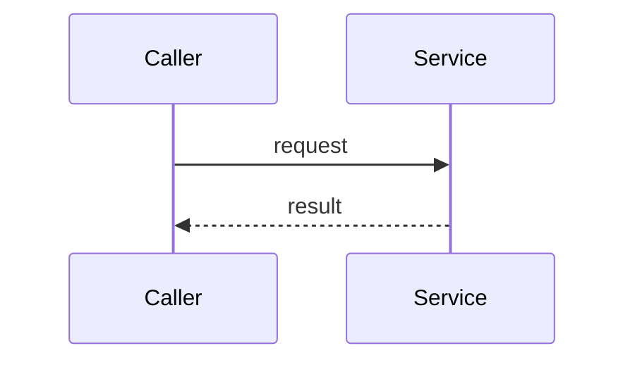

# PR descriptions

A PR description is a high-level summary. A reviewer reads it in under a minute and knows why the change exists, how it works, and why to trust it. Depth lives in the repo, in a committed doc the description links to, so it survives after the PR is merged and the description is forgotten.

Read this file completely before drafting. Run the [writing-style](../writing-style/SKILL.md) hard rules over the drafted description before presenting, committing, or pushing it. This is a pass over the text you wrote, every sentence and every diagram label, done after the draft exists. Diagram labels are prose: "lands", "surface", and glued jargon fail there too.

## The rule that sets the length

Put the reasoning a reviewer needs to approve the change in the description. Put everything a future maintainer needs in a committed doc. If you are explaining a tradeoff, a data model, an algorithm, or a migration in more than a short paragraph, stop: that belongs in a doc (see "When to write a doc"). Link it from the description and keep the description short.

The description answers four questions, in this order. Nothing else.

## The four questions

### 1. Why is the change needed

The problem or goal, in two or three sentences. Link the work item (`Resolves AB#<id>`). State the trigger: the bug, the member impact, the missing capability. No solution yet.

### 2. What is the general approach

The strategy in a few sentences, plus a diagram (see "Choosing diagrams"). The reviewer should grasp the shape of the solution before reading any prose about the parts. If the approach has a tradeoff worth recording, state the pick in one line and link the decision doc for the reasoning.

### 3. What changed

The concrete delta, plus a diagram. What is new, what moved, what was deleted. Bullet the components or files that carry the change. This is what the reviewer maps onto the diff. Keep each bullet to one line.

### 4. How have we built confidence

Why this is safe to merge. Cover what applies:

- Tests added or changed, and what behaviour they pin.
- Observability: metrics and their logs, so the change is visible in production.
- Rollout control: feature flag, phased deploy, migration order.
- Manual verification, with the environment and what you checked.

If a risk is unmitigated, say so here. A reviewer trusts an honest gap more than a silent one.

## Choosing diagrams

Pick the diagram type from what the change touches. Both the approach section and the changed section get a diagram; they can be the same type or different.

- **Interfaces, and where logic lives or runs** → class, component, or deployment diagram. Use when the change moves responsibility between classes or services, adds or reshapes an interface, or changes which process or host runs a piece of logic.
- **A workflow or a behaviour** → sequence or flow diagram. Use when the change alters the order of calls, a state machine, a decision path, or what happens across a request.
- **Both** → include more than one diagram. A change that adds a service (where) and reroutes a call sequence through it (behaviour) needs one of each.

Keep each diagram to the nodes that changed plus their immediate neighbours. A diagram that redraws the whole system hides the change. If a section's change is purely mechanical (a rename, a config bump) and a diagram would add nothing, write one line saying why there is no diagram instead of forcing one.

### Diagram mechanics

Use Mermaid in fenced ` ```mermaid ` blocks. GitHub renders these in the PR description directly. On ADO the PR description does not render Mermaid reliably, so commit the diagram in the linked doc and reference it from the description there.



Label every node and edge with a concrete name from the code. A box called "Service" teaches nothing; "PatientService" does. For a line break inside a label use `<br/>`; GitHub renders a literal `\n` as the two characters, not a break.

## When to write a doc

Write or extend a committed doc, and link it from the description, when any of these hold:

- The approach makes a significant decision about behaviour, architecture, or structure a future reader would question. → a short decision doc via the [decision-doc](../decision-doc/SKILL.md) skill.
- The change reshapes a component's behaviour or structure. → update that component's current-view architecture doc (`docs/architecture/`) so it reads as the present state, without replaying decisions.
- The change needs a whole new technical design (alternatives, system diagrams, the use-error/threat/privacy analyses). → the Technical Design Buddy skill, which produces the RFC.
- The explanation needs more than a short paragraph or more than two diagrams. → it belongs in one of the docs above, not the description.

The doc holds the depth: the decision and its reasoning, the schema, the sequence in full, the failure modes. The PR description holds the summary and one link. Check the target repo's convention for where docs live before creating a new location.

## Self-check before presenting

1. Does the description answer all four questions, in order, and nothing else?
2. Is every block of reasoning longer than a short paragraph moved to a linked doc?
3. Does the approach section and the changed section each carry a diagram (or one line saying why not)?
4. Is each diagram type the right one for what that section changed?
5. Are diagram nodes named after real code, scoped to what changed?
6. Does "how have we built confidence" name tests, observability, and rollout, and call out any unmitigated risk?
7. Have you run the writing-style hard rules over the finished draft, sentences and diagram labels both?

Fix every failure before showing the draft. The template in `templates/pr-body.template.md` is the shape to fill.
